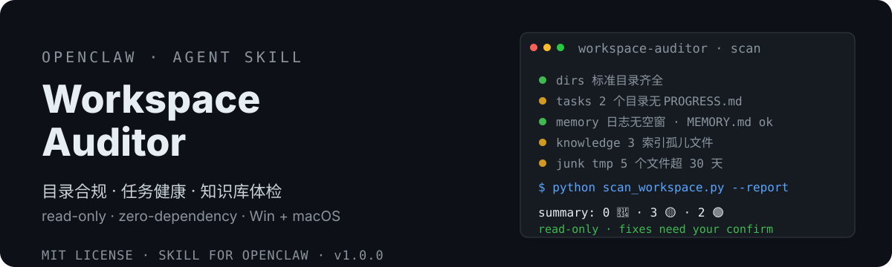

# OpenClaw Workspace Auditor 🩺

<div align="center">
  <strong>工作区体检（只读审计）</strong> | <a href="README.en.md">🌐 English</a>
</div>

<p align="center">
  
</p>

> 工作区「质检员」：只读扫描健康度——目录合规、任务进度、记忆日志、知识库索引、垃圾文件，输出分级报告 + 修复建议，永不修改任何文件。
> OpenClaw read-only workspace auditor: scans directory compliance, task health, memory gaps, knowledge-base index orphans and junk files; outputs a severity-graded report with fix suggestions. Zero-dependency, never modifies a file.


[](https://clawhub.ai/dtsola/skills/xiaoyaoclaw-workspace-auditor)

## 为什么需要

OpenClaw agent 的工作区用久了会悄悄变乱，且**你自己很难发现**：
- 🗂️ **目录失序**：根目录混入非 md 文件、命名随意、标准目录缺失
- 🧟 **任务僵尸**：目录建了 PROGRESS.md 没有、状态没更新、超龄未完结
- 🕳️ **记忆空窗**：好几天没记日志，长期记忆 MEMORY.md 缺失
- 🌑 **知识黑洞**：knowledge/ 新文件没进 data_structure.md 索引——kb-retriever 检索不到它
- 🗑️ **垃圾堆积**：tmp/ 超龄文件、超大文件占用空间

手工翻目录费时且永远不全面。这个 skill 一键解决：**一个零依赖脚本，5 类检查，分级报告，每条带修复建议。**

## 特性

- 🩺 **只读不修**：脚本永不修改/删除/移动任何文件——修复动作由你确认后执行（红线透明）
- 🗂️ **5 类体检**：目录合规（initializer 规范）· 任务健康（tracker PROGRESS.md）· 记忆健康（memory 日志）· 知识库健康（kb-retriever 索引）· 垃圾/临时文件
- 📊 **分级报告**：🔴 违规 / 🟡 警告 / 🟢 正常 / ⏭️ 降级跳过，每条附修复建议
- 🐍 **零依赖**：Python 标准库，无第三方包、无 API key、不联网、数据不出本机
- 🪜 **渐进式依赖**：没装对应姊妹技能就自动跳过该检查并提示——不会报假阳性，装得越全查得越深
- 🖥️ **双平台**：Windows / macOS 行为完全一致（纯 Python）
- 🔁 **双输出**：Markdown 报告给人看，JSON 给程序消费（可挂 cron 定期体检）

## 安装

```bash
# ClawHub（推荐）
clawhub install xiaoyaoclaw-workspace-auditor

# 或从 GitHub 手动安装
git clone https://github.com/dtsola/xiaoyaoclaw-workspace-auditor
# 把 SKILL.md、scripts/ 放到你的 skills 目录
```

## 使用

1. 把 skill 放到 OpenClaw 的 skills 目录
2. 对你的 agent 说：**「体检一下工作区」** / 「审计工作区」 / 「看看工作区乱不乱」
3. agent 自动运行扫描并给你分级报告 + 修复建议

也可以直接跑脚本：

```bash
python scripts/scan_workspace.py --report    # Markdown 报告（默认）
python scripts/scan_workspace.py --json      # JSON 输出（程序消费）
python scripts/scan_workspace.py --days 60   # 调超龄阈值（默认 30 天）
```

## 🚀 快速上手（三步，5 分钟）

### Step 1：安装技能

```bash
clawhub install xiaoyaoclaw-workspace-auditor
```

装完你的 agent 就多了一项「体检」能力，不需要任何 API key。

### Step 2：跑一次体检

对你的 agent 说一句：

> 体检一下工作区

它会在几秒内扫完整个工作区，给你一份分级报告：哪些目录不合规、哪个任务成了僵尸、知识库有没有黑洞文件、tmp 里堆了什么。

### Step 3：按建议修复（你说了算）

报告每条都带 💡 修复建议。**agent 只建议不代劳**——你确认后它才动手（或引导你用对应姊妹技能修复）。

### 日常使用习惯

| 场景 | 做法 |
|---|---|
| 每周体检 | 对你的 agent 说「体检一下工作区」，30 秒看完 |
| 自动化 | 挂 cron 每周跑 `scan_workspace.py --json`，异常时提醒 |
| 只看某类问题 | 看报告对应分区（目录合规/任务/记忆/知识库/垃圾） |
| 修复知识库黑洞 | 按建议跑 kb-retriever 的 `build_index.py` 重建索引 |
| 清理 tmp | 报告列出超龄文件，你确认后 agent 才清理 |

## 和手动检查对比

| | 手动翻目录 | **xiaoyaoclaw-workspace-auditor** |
|---|---|---|
| 覆盖 | 凭印象，总会漏 | ✅ 5 类检查全量扫描，确定性规则 |
| 一致性 | 每次结果不一样 | ✅ 正则 + 路径匹配，结果可复现 |
| 工作量 | 翻完还要自己判断 | ✅ 分级报告 + 每条修复建议 |
| 安全性 | 容易手滑删错 | ✅ 只读不修，删除必须你确认 |
| 机器可读 | 无 | ✅ JSON 输出，可挂 cron 自动化 |

## 目录结构

```
xiaoyaoclaw-workspace-auditor/
├── SKILL.md                    # 技能主体（触发词 / 工作流程 / 红线）
├── scripts/
│   └── scan_workspace.py       # 【核心】零依赖扫描脚本（5 类检查 + 双输出）
├── assets/readme/
│   ├── hero.svg                # README 封面
│   └── community-qr.png        # 交流群二维码
├── docs/
│   └── DESIGN.md               # 设计方案（检查项规则 / 降级矩阵）
├── README.md / README.en.md
└── LICENSE
```

## License

MIT — 随便用，署名可选。

---

## 🛠️ 需要定制？

**Agent & Skills 定制，价格 ¥800 起。**

- 微信：`dtsola`（添加好友时备注：**openclaw定制**）
- 服务范围：OpenClaw 多 agent 部署 / 工作区规范化 / 自定义 Skill 开发 / agent 记忆系统搭建 / 知识库搭建

## 姊妹项目

- 🏠 **xiaoyaoclaw-workspace-initializer**（工作区初始化器）：给每个 agent 一个「家」——标准目录结构 + WORKSPACE.md 规范 + 多 agent 配置安全。<https://github.com/dtsola/xiaoyaoclaw-workspace-initializer>
- 🧠 **xiaoyaoclaw-memory-distill**（记忆蒸馏）：把对话蒸馏成 MEMORY.md + 日常日志，解决上下文溢出。<https://github.com/dtsola/xiaoyaoclaw-memory-distill>
- 🗂️ **xiaoyaoclaw-task-progress-tracker**（任务进度跟踪器）：目录即容器，PROGRESS.md 即进度——tasks/ 与 projects/ 生命周期管理。<https://github.com/dtsola/xiaoyaoclaw-task-progress-tracker>
- 📚 **xiaoyaoclaw-kb-retriever**（知识库检索器）：本地知识库检索——分层 data_structure.md 索引导航 + 渐进式检索（md/pdf/xlsx），无需 API key，Windows / macOS 双平台。<https://github.com/dtsola/xiaoyaoclaw-kb-retriever>
- 📎 **xiaoyaoclaw-web-clipper**（网页剪藏）：把任意网页保存为带 frontmatter 的本地 Markdown——双引擎正文提取（readability + trafilatura 降级链）、中文文件名安全、批量剪藏 + 去重；输出直通 knowledge/clippings/，配合 kb-retriever 建索引即可检索。<https://github.com/dtsola/xiaoyaoclaw-web-clipper>
- 🤝 **xiaoyaoclaw-agent-orchestrator**（Agent 协作编排，**协作层**）：架在七件套之上——拆任务、分 agent、管进度、聚结果、失败重试。<https://github.com/dtsola/xiaoyaoclaw-agent-orchestrator>
- 📊 **xiaoyaoclaw-usage-report**（用量报告）：解析 session JSONL，回答「每次 agent 任务花了多久、用了哪些工具/技能/模型、消耗了多少 token」——零依赖纯本地，token 为主指标。<https://github.com/dtsola/xiaoyaoclaw-usage-report>

## 